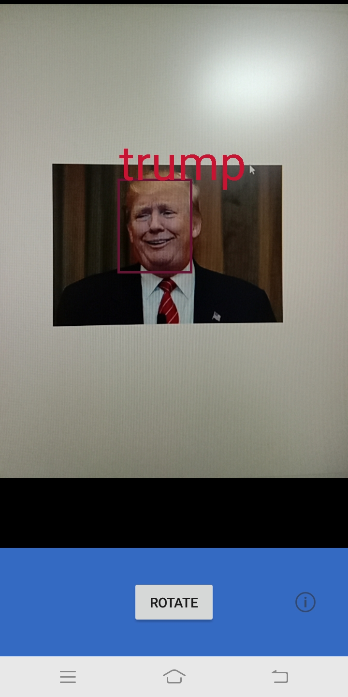
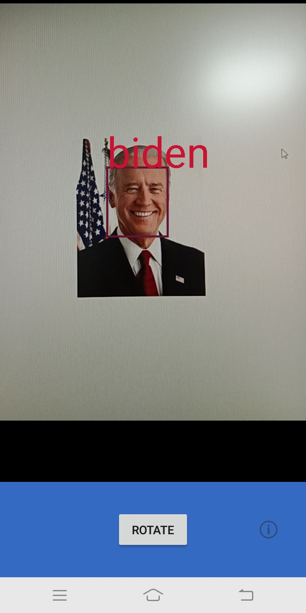

# FLKL
This is a Android face recognition repository.This repository is to find LKL.

This project is based on android-Camera2Basic.It can recognize faces captured by cameras and box them out.

Face recognition steps:
- 1.Face Detection
- 2.Face Alignment
- 3.Get Face Feature
- 4.Calculate similarity

This repository refers to the following projects:
- [MNN](https://github.com/alibaba/MNN)
- [android-Camera2Basic](https://github.com/googlearchive/android-Camera2Basic)
- [dlib](https://github.com/davisking/dlib)
- [face_recognition](https://github.com/ageitgey/face_recognition)
