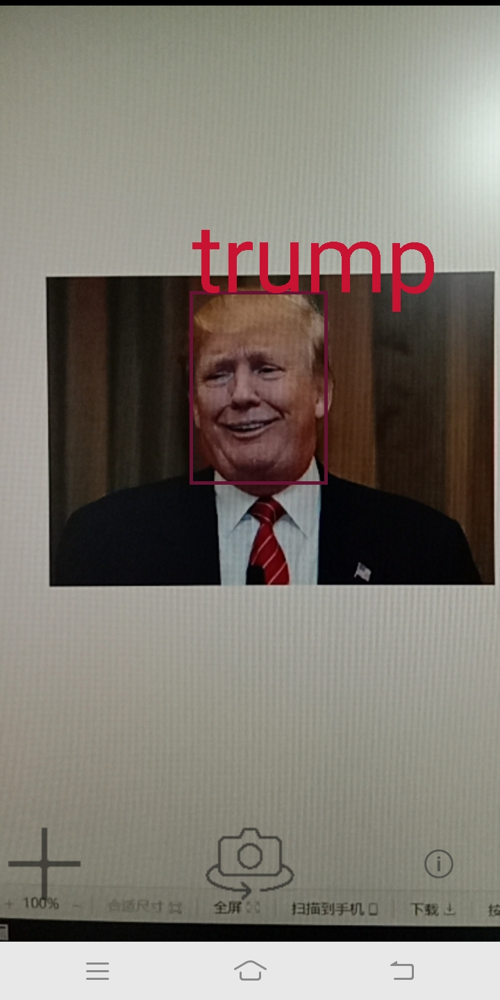
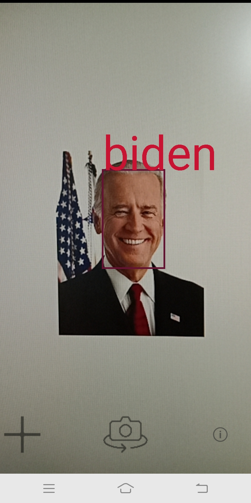

# FLKL
This is an Android face recognition repository,which can recognize the faces captured by the camera and box them out.This repository is to find the lkl.

This project is based on android-Camera2Basic.

Face recognition steps:
- 1.Face Detection
- 2.Face Alignment
- 3.Get Face Feature
- 4.Calculate similarity

This repository refers to the following projects:
- [MNN](https://github.com/alibaba/MNN)
- [android-Camera2Basic](https://github.com/googlearchive/android-Camera2Basic)
- [dlib](https://github.com/davisking/dlib)
- [face_recognition](https://github.com/ageitgey/face_recognition)
